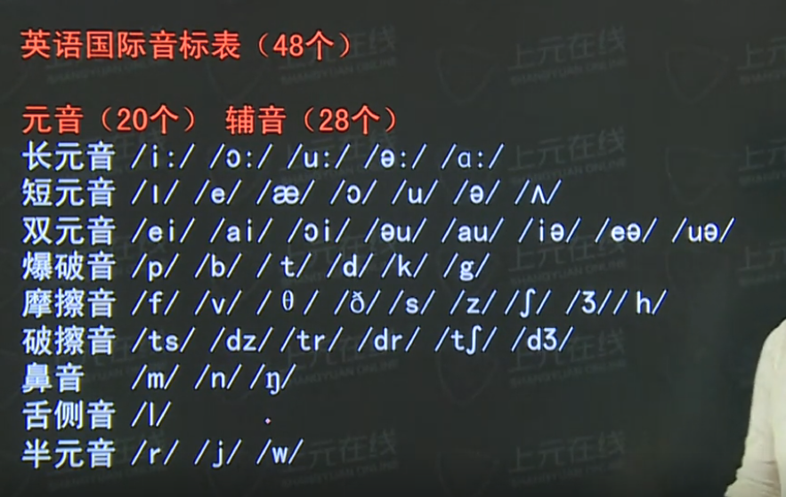

## Learn English notes

### 新概念英语发音1

We should try to put the principal into practice

我们应该把理论用于实践

---

Let's get together when the weather is better

让我们在天气好转后聚一聚

---

It is very bad of you to talk back to your dad. 

你竟然和你爸爸顶嘴，真是太无礼了。

---

She is standing in the doorway and eating a hot dong.

她正站在门口，吃热狗

---

He understood what the women wanted.

他知道那个女人需要什么

---

I am afraid that the color is unsuitable for my mother. 

恐怕这种颜色不适合我妈妈。

---

I am not accustomed to making a speech in public.

我不习惯在公众场合大发言论。

--- 

短元音部分